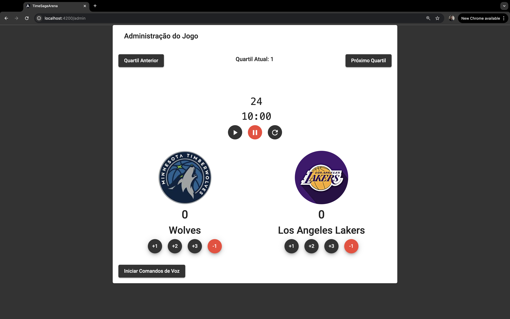
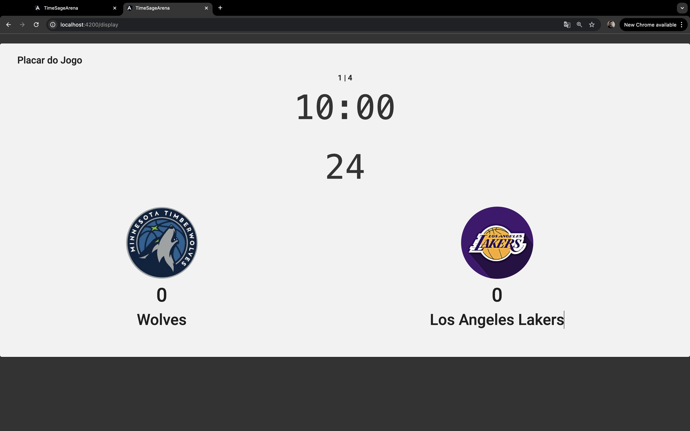
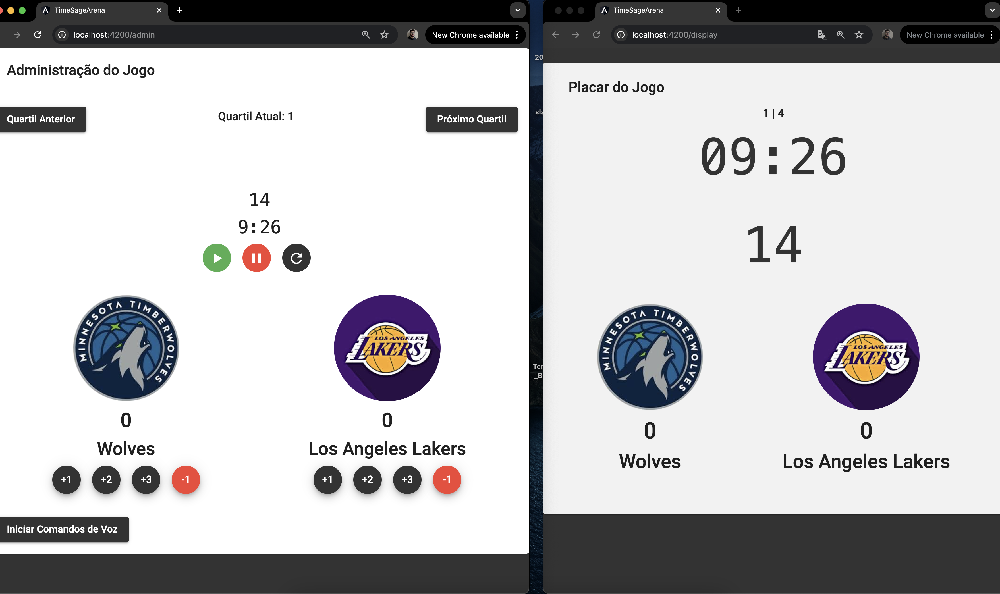

# Time Sage Arena

## Passos Iniciais

### Clonar o repositório

```bash
git clone https://github.com/pedroHenriqueMaia/time-sage-arena.git
cd time-sage-arena
```

### Instalar Dependências

Certifique-se de ter o Node.js (versão 16.0 ou superior) instalado na sua máquina. Depois, execute:

```bash
npm install
```

### Executar projeto localmente

Subir projeto Angular
```bash
npm start
```

Subir server com WebSocket
```bash
cd server/
npm start
```

### Telas do projeto



